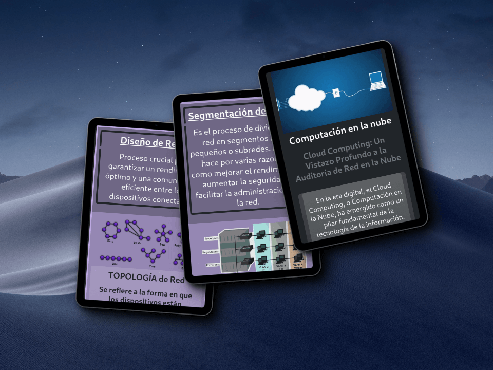

# Proyecto de Redes

## Objetivos:

- Aprender tecnologías como Bootstrap y GitLab
- Crear un Blog en donde resumo mi ruta de aprendizaje autodidacta en una guía de estudios que puede ayudar a otras personas interesadas en el campo de las Telecomunicaciones.

<h3 align="left">Herramientas:</h3>

   

